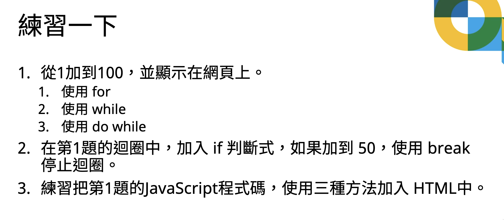

# Homework 2022-12-01

## Part 1: for/while/do-while Practices

- [`for` way](./for-practice/for-way.html)
- [`while` way](./for-practice/while-way.html)
- [`do-while` way](./for-practice/do-while-way.html)

## Part 2: break-in-loop Practices

- [`do-while` until fifty](./for-practice/do-while-way-until-50.html)

## Part 3: 4 ways to add scripts to HTML code

- [Add at `<head>`](./script-at/script-at-head.html)
- [Add at `<body>`](./script-at/script-at-body.html)
- [Add at `<head>`, deferred triggering](./script-at/script-at-head-with-defer-triggering.html)
- [Import from external scripts](./script-at/script-at-link.html)

## Part 4: 4 ways to append text to DOM tree

- [`document.write()` way](./html-insert-approach/document-write.html)
- [`appendChild()` way, `querySelector("body")`](./html-insert-approach/append-child.html)
- [`innerText()` overwrite way, `getElementsByTagName("body")`](./html-insert-approach/inner-text-overwrite.html)
- [`innerText()` append way, `document.body`](./html-insert-approach/inner-text-append.html)
