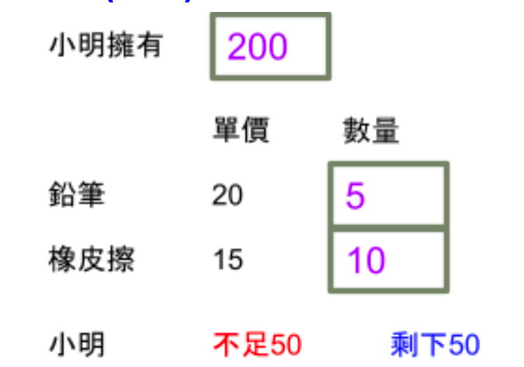

# Futtes – A basic template of a test

## Q2

小明總共有 $x$ 元，想購買鉛筆 $y$ 隻，橡皮擦 $z$ 個，其中鉛筆單價為 $25$ 元，橡皮單價為 $15$ 元， 試輸入 $x,y,z$ 的值，並計算應找回多少元(藍色顯示)或不足多少元(紅色顯示)，顯示畫 面如下。(本題目不用 Click 事件)



## Tech stack

- TypeScript
- Web Component (`lit`)
- Vite
- UnoCSS

For testing:

- Vitest for Unit Test
- Playwright for E2E Test

For code quality assuring:

- ESLint
- Prettier

## Workflow

```bash
# lint and format code
pnpm lint && pnpm fmt

# run tests
pnpm test:unit
pnpm test:e2e

# remember to commit the changes
git commit -am "..."

# build
pnpm build

# copy the source to the dist folder
name=$(jq -r ".name" package.json)
git archive HEAD --format=zip --output answers/$name-src.zip
cp README.md answers/$name/README.md
# the answers folder is the artifact.
```
