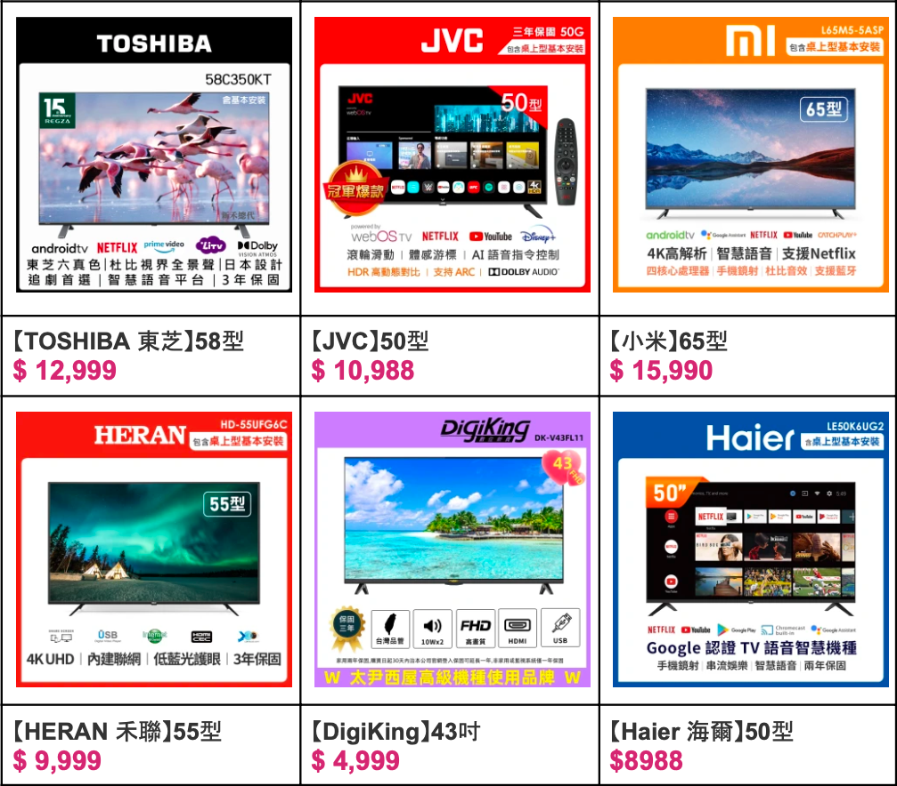
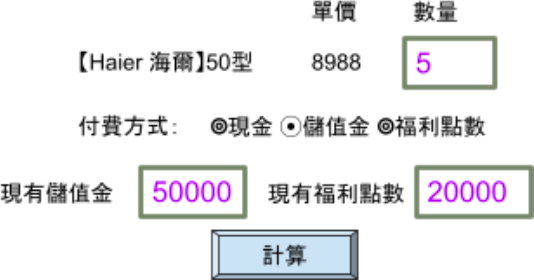

# 第三題 (35%)

某商場可販售商品如下：

當點選某一商品後（如：【Haier 海爾】50型），就會進入下一個步驟：

假設付費方式可分成現金、福利點數與儲值金三種，其付款情況如下:

- 現金支付：回饋 $5\%$ 的福利點數，總價不打折
- 儲值金支付：回饋 $10\%$ 的福利點數，總價並打九折
- 福利點數支付：不回饋福利點數，總價不打折

試輸入其具有的儲值金與福利點數，及其購買各商品的相關數量，選擇付費方式後，計算其購買總價後，判斷是否具備可付條件，並調整相關數據，呈現支付清單。
