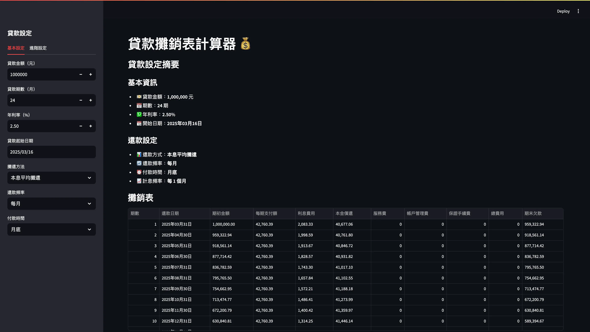
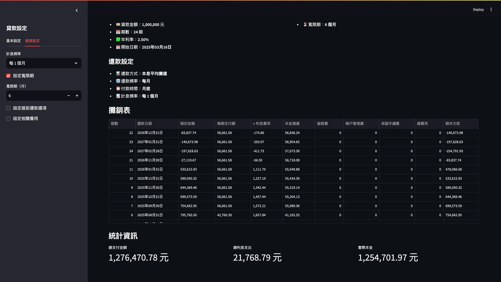
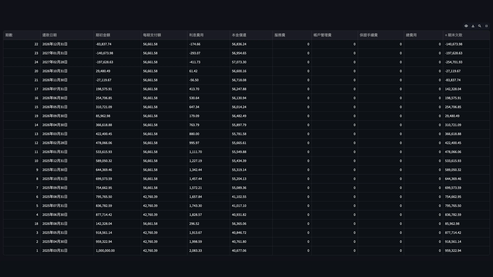

# Hw1: 分期償還表

## 執行截圖

Streamlit 版本：







## 執行指南

1. **安裝 uv**
   - 在 PowerShell 中，執行以下命令安裝 [uv](https://docs.astral.sh/uv)：
     ```bash
     powershell -ExecutionPolicy ByPass -c "irm https://astral.sh/uv/install.ps1 | iex"
     ```
   - 在 Bash 中，執行以下命令安裝 [uv](https://docs.astral.sh/uv)：
     ```bash
     curl -LsSf https://astral.sh/uv/install.sh | sh
     ```
   - 如果已經配置 [Python](https://www.python.org) 了，可以使用 pip 安裝：
     ```bash
     pip install uv
     ```

2. **安裝所需套件**
   - 在命令提示字元中，切換到專案目錄：
     ```
     cd 路徑\到\專案資料夾
     ```
   - 使用 uv 安裝必要的套件：
     ```
     uv sync
     ```

3. **執行應用程式**
   - 在專案目錄中使用 uv 執行：
     ```
     uv run streamlit run streamlit_app.py
     ```
   - 瀏覽器會自動開啟應用程式，或者您可以手動存取終端機顯示的網址（通常是 http://localhost:8501）

## 測試指南

這個 codebase 的 `calculate.py` 達到 100% 測試覆蓋率了。執行：

```bash
uv run pytest --cov=. .
```

來執行測試，同時計算測試覆蓋率。
