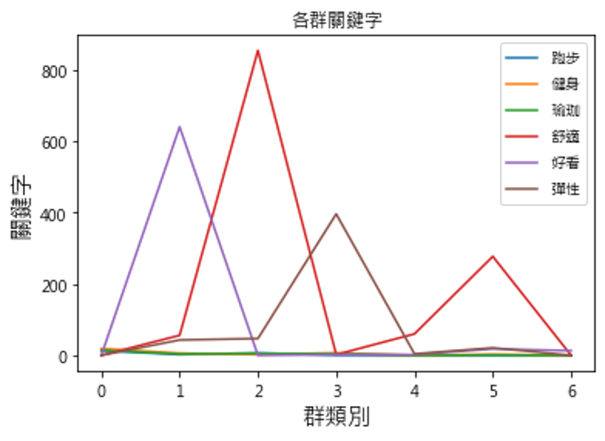

# K-means 分群法

- 非監督式(unsupervised)分群的演算法
- 利用向量距離來做聚類

## 決定最佳分群數

### Elbow Method (手肘法)

- 分群目的：一群裡的資料同質性高，不同群的資料同質性低。
- 做法：找出一個數字 $n$，當資料被分成 $n$ 群時，群內的總變異(SSE)會最小，$n$ 即為最佳分群數目 (optimal number for clusters)！
- 適用於 K 值相對較小的情況
- 評估法：
  - 選擇的 k 值小於真正的時，k 每增加 1，cost 值就會大幅的減小
  - 當選擇的 k 值大於真正的 K 時，k 每增加 1，cost 值的變化就不會那麼明顯。
  - 正確 k 值就會在轉捩點

### Average Silhouette Method (平均側影法)

- 側影系數(Silhouette Coefficient)會根據每個資料點(i)的內聚力和分散力，衡量分群的效果(quality)。
- 公式
  $
  s(i) = \frac{b(i) - a(i)}{max(a(i), b(i))}
  $
  - $a(i)$：資料點 i 與同群其他資料點的平均距離
  - $b(i)$：資料點 i 與最近的其他群的平均距離
  - $s(i)$：資料點 i 的側影系數，可以視為資料點(i)，在它所屬的群內是否適當的指標
  - 我們便利用這個方法，取每一個資料點的側影平均值(故稱 Avg. Silhouette Method)，當作衡量最佳分群數目的準則！
- **Average Silhouette 值越大越好**

## 總結

- 分群(Clustering)屬於非監督式學習，主要根據資料本身的特性，來進行資料分析的一種方法。
- 實務上，當我們對資料還沒有深入了解時，便可以先使用分群方法，觀察潛藏在資料中的特性，再擬定後續分析的手法。
- 在使用分群方法時，不同的分群數目，往往會對最後的結果有巨大的影響。因此找到最佳的分群數目，是很重要的課題！

## 應用

- 以顧客留言的**關鍵字數量**進行分群
- 計算各群的關鍵字得分，如此得知各群屬性

